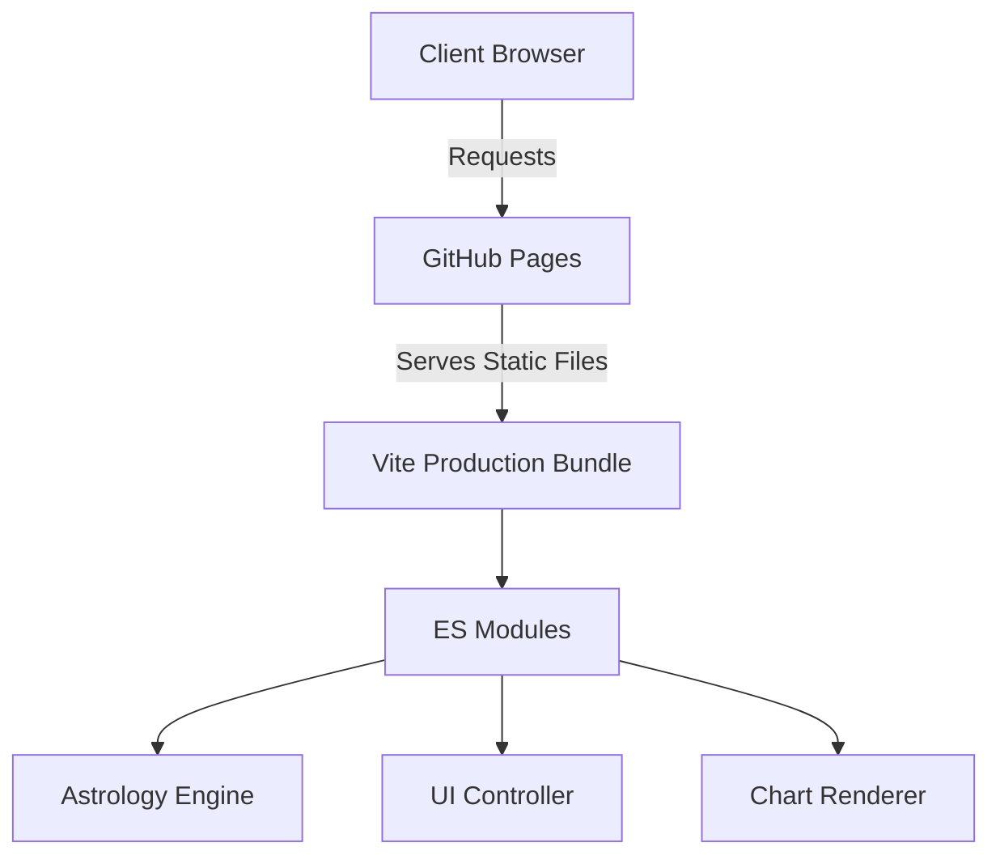
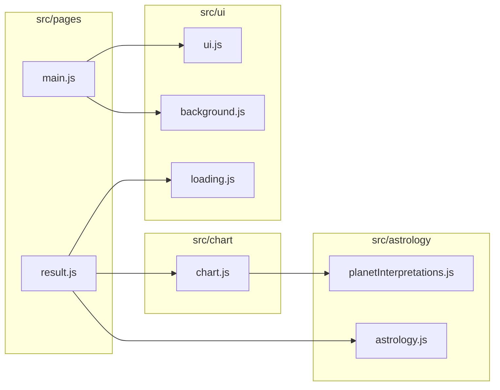
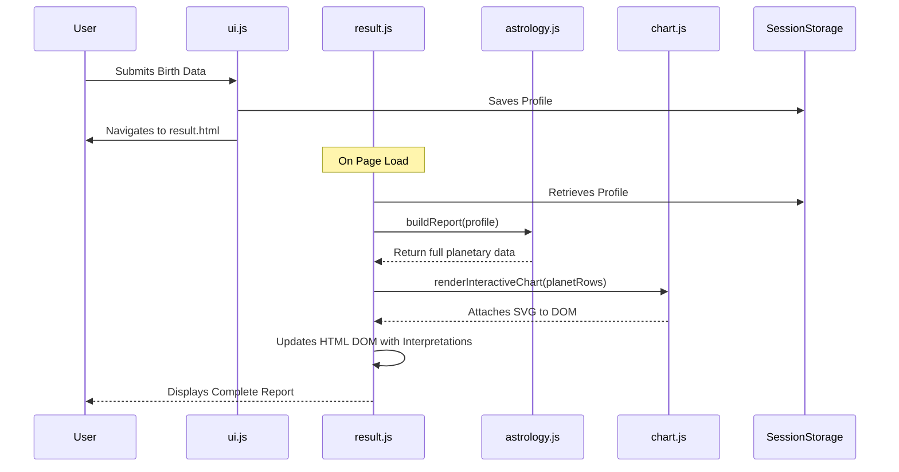

# Astro Numerology Blueprint

A professional interactive astrology and numerology web application. This project generates a complete Birth Blueprint including planetary longitudes, numerological influences, and an interactive 360° SVG Zodiac chart.

## Features

- **Precision Astrology Engine**: Uses astronomical formulas to precisely compute Julian Dates, Ascendant, and Planetary longitudes.
- **Chaldean Numerology**: Determines the Mulank, Bhagyank, and Naamank numbers based on birth dates and names.
- **Interactive Zodiac Visualization**: An interactive 360° SVG interactive birth chart rendering real-time planetary aspects and hover interactions.
- **Responsive & Accessible UI**: Fully responsive, high-performance glassmorphism interface optimized for all devices.

## Architecture & Engineering

### System Architecture

This application is built on a modern, robust, frontend-only architecture utilizing **Vite**, **ES Modules**, and **Vanilla JavaScript** to achieve maximum performance without the overhead of heavy UI frameworks.

### Module Dependency Diagram

The codebase is organized into cleanly separated domains, isolating complex calculation logic from presentation layers.

### Report Generation Sequence

The core business flow separates data ingestion, computation, layout calculations, and DOM updates to ensure a smooth, non-blocking user experience.

## Testing Strategy

The core calculation logic handles complex, math-heavy astronomical algorithms that require extreme stability. 
To protect this, we employ a comprehensive testing suite utilizing **Vitest**:

- **Unit Tests**: Coverage for individual, pure utility functions like `degreeInSign`, `digitalRoot`, and `houseFor`.
- **Regression Snapshots**: We maintain hardcoded, historically accurate profiles (e.g., Albert Einstein). Our tests render full planetary computations against these profiles and assert them against frozen snapshots to ensure mathematical drift never occurs.

**Current Test Coverage**: `99.1%` (Statements) in `src/astrology/astrology.js`.

## Deployment Architecture

The application implements a full CI/CD pipeline using **GitHub Actions**.

- **Triggers**: Automated on pushes/PRs to `main`.
- **Pipeline**:
  1. Checks out repository.
  2. Resolves dependencies via `npm ci`.
  3. Lints the codebase with ESLint to enforce best practices.
  4. Runs Vitest and generates code coverage.
  5. Bundles an optimized production build using Vite.
  6. Automatically deploys to GitHub Pages upon success.

### Lighthouse Expectations

By aggressively optimizing assets, minifying code via Vite, implementing lazy loading, and adding strict SEO/PWA metadata, the deployed application targets perfect Lighthouse scores.

| Category       | Expected |
| -------------- | :------: |
| Performance    |  95–100  |
| Accessibility  |  95–100  |
| Best Practices |  95–100  |
| SEO            |  95–100  |

## License
MIT
